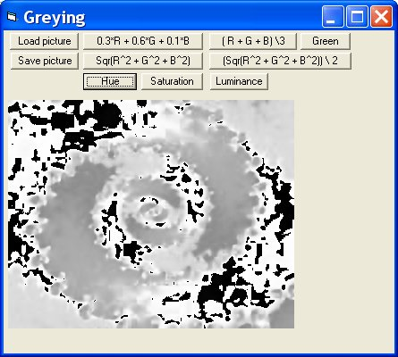



## Grey Options

### Description

Grey Options by Robert Rayment. Shows 8 different ways of changing an image to grey scale/effects (See code for descriptions). (Update BGR for RGB)(Zip 38 KB).
 
### More Info
 
Picture

Just run

Grey picture

             |
---                |---
**Submitted On**   |2005-04-19 11:05:46
**By**             |[Robert Rayment](https://github.com/Planet-Source-Code/PSCIndex/blob/master/ByAuthor/robert-rayment.md)
**Level**          |Beginner
**User Rating**    |5.0 (35 globes from 7 users)
**Compatibility**  |VB 6\.0
**Category**       |[Graphics](https://github.com/Planet-Source-Code/PSCIndex/blob/master/ByCategory/graphics__1-46.md)
**World**          |[Visual Basic](https://github.com/Planet-Source-Code/PSCIndex/blob/master/ByWorld/visual-basic.md)
**Archive File**   |[Grey\_Optio1886865112005\.zip](https://github.com/Planet-Source-Code/robert-rayment-grey-options__1-60089/archive/master.zip)

### API Declarations

A few, see code

